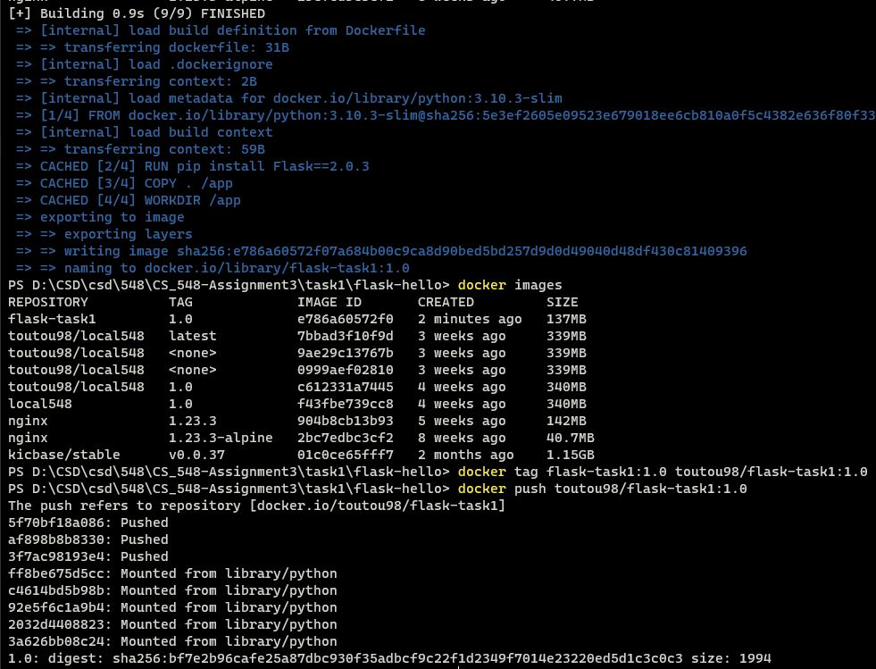
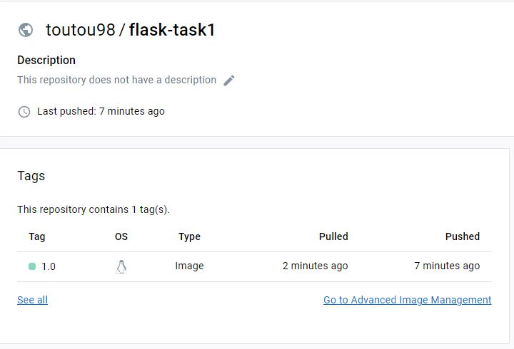
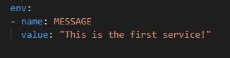
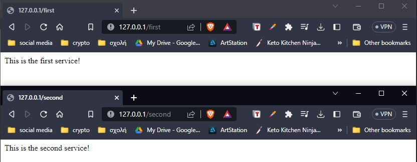
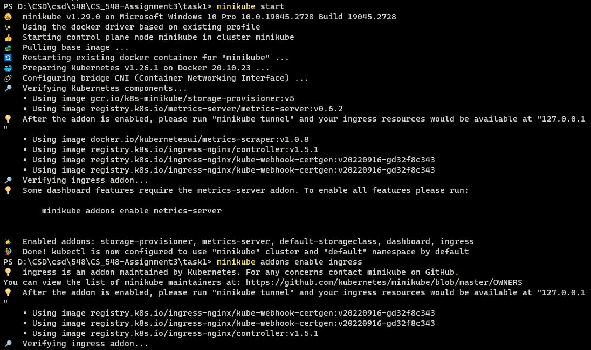
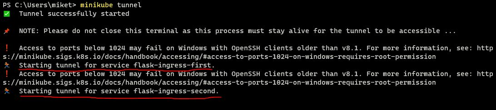
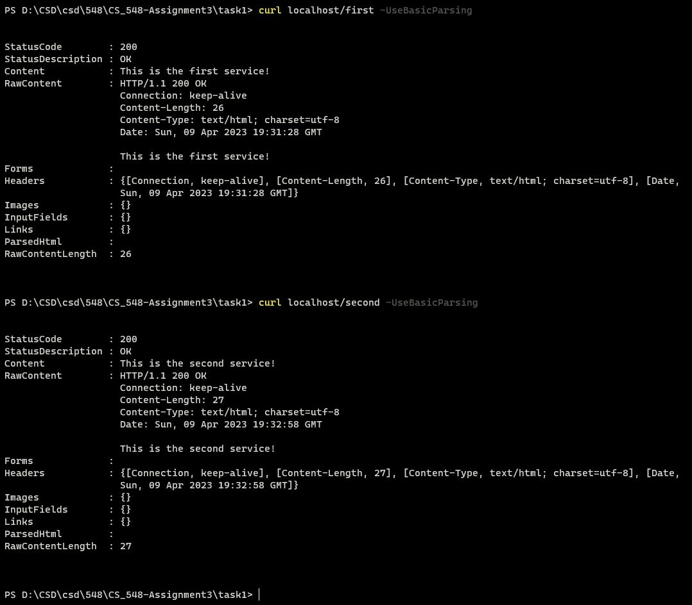

# CS_548-Assignment3
## csd4054

---

### Task 1
  * a)
		
		Αρχικά κατεβάζω το Dockerfile και το hello.py από το git repo και έπειτα αλλάζω το return του
        app σε: return str(os.getenv('MESSAGE')) για να επιστρέφει το enviroment variable MESSAGE.
        Έπειτα κάνω build χρησιμοποιόντας το Dockerfile εκτελώντας: docker build -t "flask-task1:1.0" .
        Έχοντας το νέο image, προσθέτω ένα tag για το remote repo και έπειτα κάνω push το image στο
        Dockerhub.
			
	
    

  * b)
	
		Άρχικα αντιγράφω το flask.yaml του παραδείγματος και κάνω τις εξής αλλαγές:
        1) Αλλάζω το path από /hello σε /first και /second για τα 2 yaml
        2) Αλλάζω το image που κάνει pull για να παίρνει αυτό που ανέβασα πριν
        3) Προσθέτω το enviroment variable MESSAGE και προσθέτω το μύνημα της εκφώνησης

	

        Κάνοντας: kubectl apply -f first.yaml
                  kubectl apply -f second.yaml
                  minikube tunnel
        
        Μπορούμε να δούμε στο 127.0.0.1/first και 127.0.0.1/second τα μυνήματα που βάλαμε στα
        enviroment variables.
		
    

  * c)
	
		Ουσιαστικά στο προηγούμενο ερώτημα αφού μπορούμε να δούμε σωστά τα μυνήματα στον Browser
        μπορούμε να καταλάβουμε ότι λειτουργεί σωστά.
        Τα βήματα από την αρχή είναι:
            1) minikube start
            2) minikube addons enable ingress

    

            3) minikube tunnel (σε άλλο τερματικό)

    

            4) kubectl apply -f first.yaml
            5) kubectl apply -f second.yaml\
            6) curl localhost/first -UseBasicParsing
            7) curl localhost/second -UseBasicParsing

        και μπορούμε να δούμε και εκεί τα μυνήματα που έχουμε

    
			
	
		
		
		
### Task 2
  * a)

		*insert text*
	
	
	

  * b)
	
		*insert text*
			
		
	
### Task 3
  * a)

		*insert text*
		
	
	
	
	

### Task 4
  * a)

		*insert text*
		
	
	
  * b)
	
		*insert text*
			
	
		
  * c)
	
		*insert text*
			
	

  * d)
	
		*insert text*
			
	

