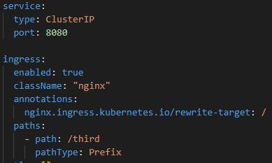
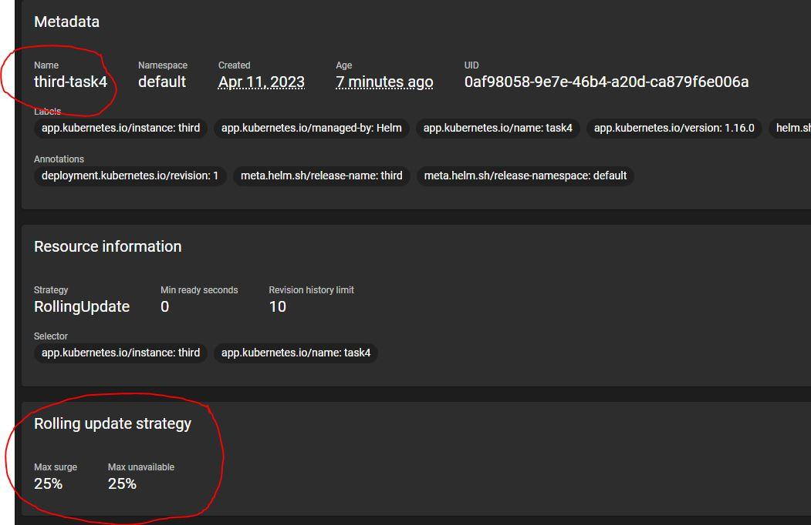

# CS_548-Assignment3
## csd4054

---

### Task 1
  * a)
		
		Αρχικά κατεβάζω το Dockerfile και το hello.py από το git repo και έπειτα αλλάζω το return του
        app σε: return str(os.getenv('MESSAGE')) για να επιστρέφει το enviroment variable MESSAGE.
        Έπειτα κάνω build χρησιμοποιόντας το Dockerfile εκτελώντας: docker build -t "flask-task1:1.0" .
        Έχοντας το νέο image, προσθέτω ένα tag για το remote repo και έπειτα κάνω push το image στο
        Dockerhub.
			
	
    

  * b)
	
		Άρχικα αντιγράφω το flask.yaml του παραδείγματος και κάνω τις εξής αλλαγές:
        1) Αλλάζω το path από /hello σε /first και /second για τα 2 yaml
        2) Αλλάζω το image που κάνει pull για να παίρνει αυτό που ανέβασα πριν
        3) Προσθέτω το enviroment variable MESSAGE και προσθέτω το μύνημα της εκφώνησης

	

        Κάνοντας: kubectl apply -f first.yaml
                  kubectl apply -f second.yaml
                  minikube tunnel
        
        Μπορούμε να δούμε στο 127.0.0.1/first και 127.0.0.1/second τα μυνήματα που βάλαμε στα
        enviroment variables.
		
    

  * c)
	
		Ουσιαστικά στο προηγούμενο ερώτημα αφού μπορούμε να δούμε σωστά τα μυνήματα στον Browser
        μπορούμε να καταλάβουμε ότι λειτουργεί σωστά.
        Τα βήματα από την αρχή είναι:
            1) minikube start
            2) minikube addons enable ingress

    

            3) minikube tunnel (σε άλλο τερματικό)

    

            4) kubectl apply -f first.yaml
            5) kubectl apply -f second.yaml\
            6) curl localhost/first -UseBasicParsing
            7) curl localhost/second -UseBasicParsing

        και μπορούμε να δούμε και εκεί τα μυνήματα που έχουμε

    
			

### Task 2
  * a)

		Περιορισμός Pod σε 20% cpu και 256MB ram.
	
	

		Κάνω enable τον metrics-server:
		minikube addons enable metrics-server

		Η εντολή που χρησιμποιώ για το autoscaling είναι: 
		kubectl autoscale deployment flask-first --cpu-percent=80 --min=1 --max=8

		Άρα συνεχίζοντας από την προηγούμενη άσκηση κάνουμε πάλι:
		kubectl apply -f first.yaml
		kubectl apply -f locust.yaml
		kubectl autoscale deployment flask-first --cpu-percent=80 --min=1 --max=8
		minikube ip

	

		Βάζω 100 χρήστες και 1 ανα δευτερόλεπτο στο 1ο service.
	
	
	

		Ξεκινάω το benchmark και βλέπω ότι ο autoscaler σηκώνει κατευθείαν 3 extra replicas και έχει 4 pod
		συνολικά με το κάθε ένα να έχει 250 RPS περίπου.

	
	

		Συνεχίζει σηκώνοντας και ένα πέμπτο pod και φτάνει στα 1250RPS

	
	

		Παρατηρώ ότι σηκώνει άλλα 3 replicas και πάει στα 8 συνολικά. Εκεί σταματάει να σηκώνει και άλλα
		γύρω στα 1300 RPS. Θεωρητικά μπορούσε και με 6 pods να κάνει το service αλλά έτσι θα ήταν πολύ πιο πάνω από το 80% threshold που έχει. Εκεί σταματάει να δημιουργεί και άλλα Pods. 

	
	

		Επομένως με τον autoscaler μπορούμε να έχουμε 1300RPS με 74% cpu utilization ενώ με το 1 Pod είχαμε
		250RPS στο 100% cpu utilization

### Task 3
  * a)

		Κάνω install το Helm με χρησιμοποιόντας τον choco windows package manager:
		choco install kubernetes-helm

		Έπειτα ακολουθόντας τις οδηγίες από το artifacthub.io :
		1) helm repo add ingress-nginx https://kubernetes.github.io/ingress-nginx
		2) helm repo update
		3) helm install hy548-ingress ingress-nginx/ingress-nginx
		
	

		Η αλλαγή που πρέπει να κάνω στα YAMLs είναι να προσθέσω το:
		ingressClassName: nginx

	

		Μετά κάνω :
		minikube tunnel
		kubectl apply -f first.yaml
		kubectl apply -f second.yaml

	

		Βλέπουμε στο κάθε path το σωστό μήνυμα επομένως δουλεύει.

### Task 4
  * a)

		Άρχικά φτιάχνω το Helm chart:
		helm create task4
		
		Έπειτα κάνω τις εξής αλλαγές:
		1) values.yaml

			Βάζω στο image αυτό που ανέβασα στο Dockerhub και να κάνει πάντα pull.
			Αλλάζω το Port στο server από 80 σε 8080
			Κάνω enable το ingress με className: "nginx" και προσθέτω το annotation.
			Επίσης βγάζω τον host που μου είχε προσθέσει.
			Βάζω στα resources cpu limit 250m που ζητάει η εκφώνηση.
			Κάνω enable το autoscaling με min-max στα 1 έως 20 που ορίζει η εκφώνηση και προσθέτω στο
			message το "this is the third service!"

	

	

	
	
	

		2) deployments.yaml
			Προσθέτω το enviroment variable που θα έχει το message

	

		3) service.yaml
			Αλλάζω το targetPort

	

		4) ingress.yaml
			Αφαιρώ τις γραμμές που ήταν για τους hosts καθώς το έβγαλα και από το values.yaml

		Επομένω μπορώ να τρέξω:
		helm install third task4 --values task4/values.yaml

		και όταν πάω στο 127.0.0.1/third βλέπω το message
	
	
	
	

		Επίσης θα μπορούσα αντί να δηλώσω τα replicates, limits κτλπ μέσα στο values.yaml να τα βάλω και σαν
		command line args όταν κάνω το helm install π.χ με --set autoscaling.maxReplicates=20

	
